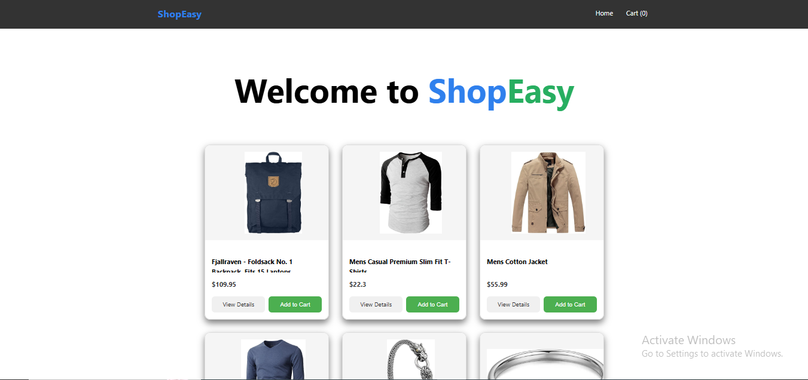
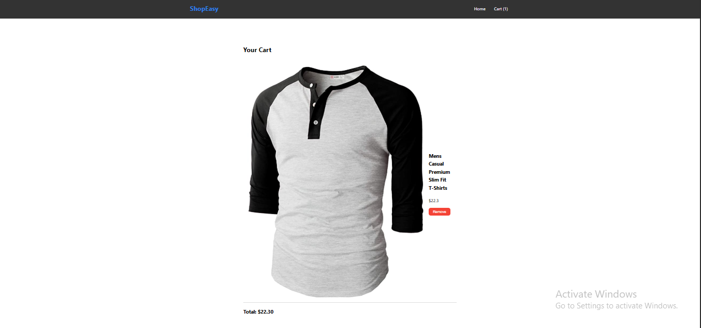
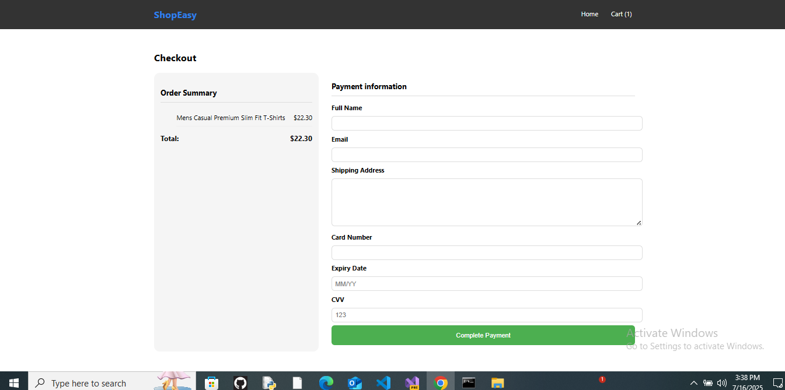
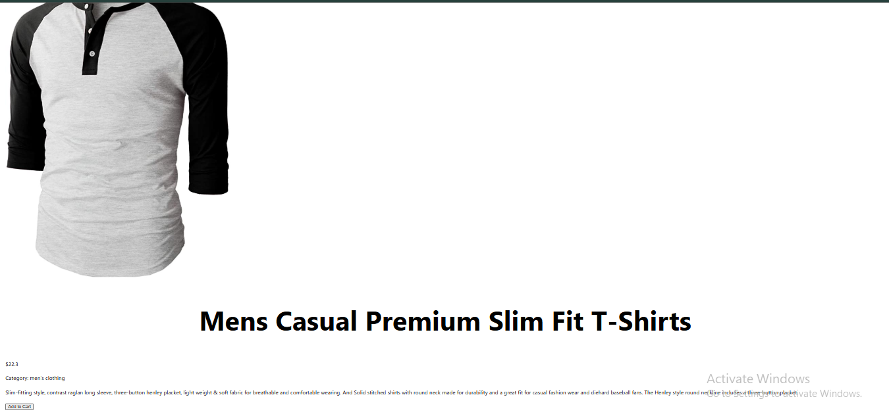

# 🛒 ShopEasy – React E-commerce App

ShopEasy is a fully functional and responsive e-commerce web application built using **ReactJS**. It allows users to browse products, view details, add items to the cart, and simulate a complete checkout process with form validation.

---

## 🔗 Live Features

- Product listing with real-time data from [FakeStoreAPI](https://fakestoreapi.com/)
- Cart functionality with live total
- Product detail view
- Payment simulation with form validation
- Responsive design and styled UI

---

## 🖼️ Home Page

- This is the landing page of the app where products are displayed.
- The data is fetched dynamically from **FakeStoreAPI**, so no backend setup is required.
- Each product card includes:
  - Image  
  - Price  
  - View Details link  
  - Add to Cart button

---

## 🛒 Cart Section

- This section shows all products added to the cart.
- Each product in the cart displays:
  - Title
  - Price
  - Image
  - Remove Button
- Below the list, the **total bill** is calculated and shown.
- If cart is empty, a message is shown accordingly.

---

## 💳 Checkout Page

- This is the **payment process screen**.
- Left side displays:
  - List of items with subtotal
- Right side displays:
  - Payment form with fields like:
    - Full Name
    - Email
    - Address
    - Card Number
    - Expiry Date
    - CVV
- It includes error handling and shows success message after "payment".

---

## 🔍 Product Detail View

- This screen shows **detailed information of a selected product**:
  - Full description
  - Category
  - Title
  - Price
  - Add to Cart button
- The layout is responsive and includes a large product image with structured content.

---

## 🛠️ Tech Stack

- **Frontend**: ReactJS, React Router DOM, CSS
- **API**: [FakeStoreAPI](https://fakestoreapi.com/)
- **State Management**: useState & Props

---

## 📝 Notes

- No backend is required. This is a frontend-only mock app.
- The cart does not persist on refresh (localStorage can be added).
- The payment is **mocked** and not real.

---

## 🚀 Author

Developed with 💻 by **Majid Ali**  
_An aspiring Full Stack Developer_

---

Feel free to fork, improve, and use this code in your own projects!  

